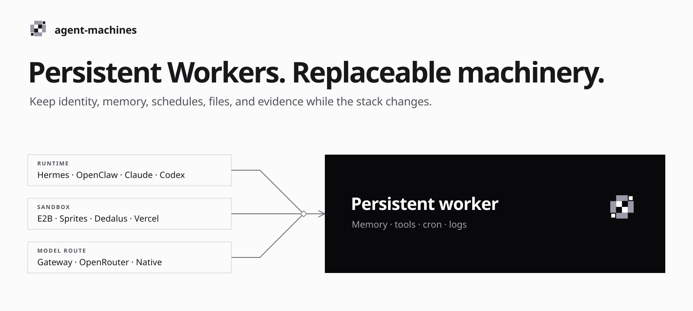
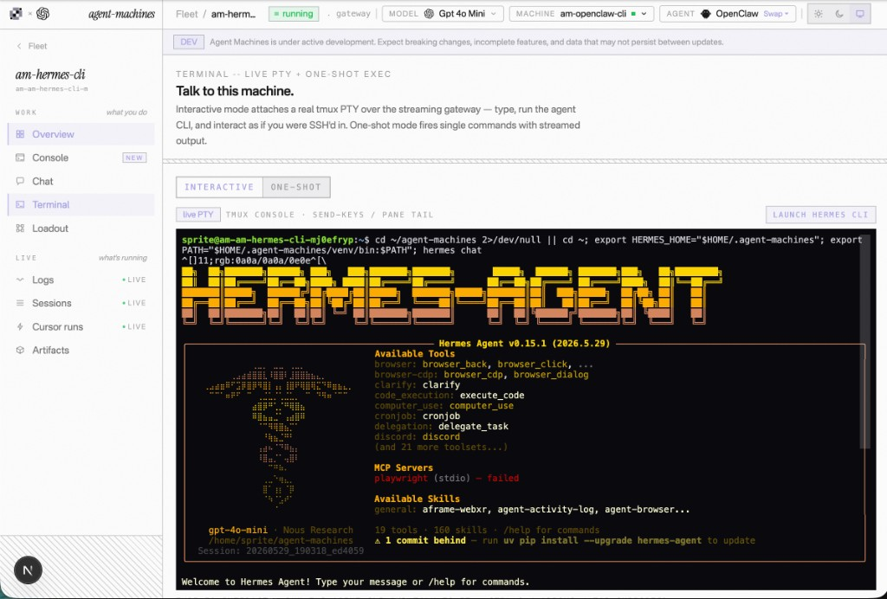
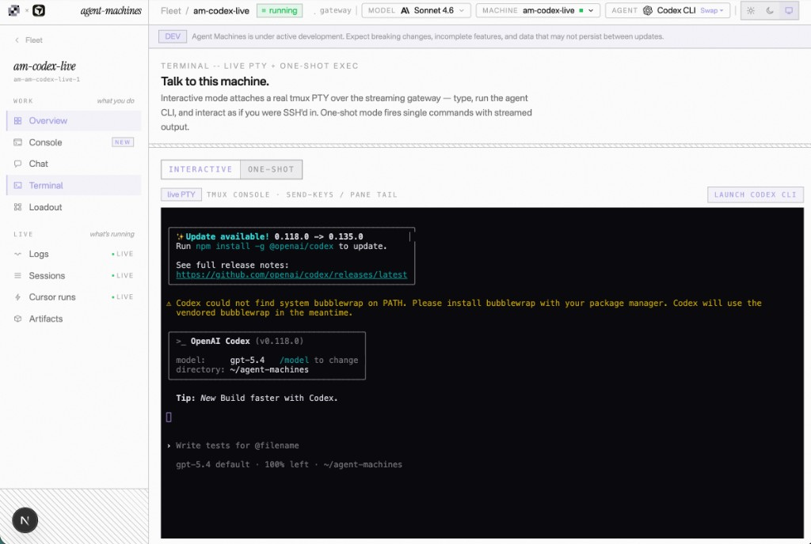

<p align="center">
  <a href="https://www.agent-machines.dev">
    
  </a>
</p>

# agent-machines

> **OpenRouter for agents and containers.**

Agent Machines is the **product layer** above sandboxes: a control plane that deploys a **persistent agent worker** as one unit (runtime, skills, MCP, integrations, cron, observation, and fleet management) on any substrate you route to.

People don't want a bare sandbox. They want a worker that audits code, runs on a schedule, and gets smarter over time. This repo is the **control plane**, not the agent runtime package.

Live site: <https://www.agent-machines.dev>
Source: <https://github.com/Kevin-Liu-01/agent-machines>

---

## Table of contents

- [What it is](#what-it-is)
- [The core idea: dual routing](#the-core-idea-dual-routing)
- [Browser Agent Console](#browser-agent-console-live-cli-in-the-browser)
- [Deploy → Bootstrap → Attach → Talk](#deploy--bootstrap--attach--talk)
- [The streaming gateway](#the-streaming-gateway-capability-tiered)
- [The harness](#the-harness-registry-driven)
- [Architecture](#architecture)
- [Provider capability matrix](#provider-capability-matrix)
- [Quick start](#quick-start)
- [CLI](#cli)
- [Web app](#web-app)
- [Dashboard surfaces](#dashboard-surfaces)
- [Repository layout](#repository-layout)
- [Data boundaries and security](#data-boundaries-and-security)
- [Further reading](#further-reading)

---

## What it is

One account to route **which agent runtime** and **which substrate**, then receive a full persistent worker instead of an empty box.

| Analogy | Meaning |
|---------|---------|
| **OpenRouter for agents and containers** | One account routes which runtime and which substrate, the way OpenRouter routes models |
| **Vercel on AWS** | We are the product layer; substrates are interchangeable infrastructure underneath |

Building sandboxes is hard. We **route** across existing ones instead of rebuilding infra, and keep the value in the harness, the control plane, and observation.

**Two audiences:**

1. **Humans** operate the dashboard: route runtime + substrate, provision presets, supervise the fleet.
2. **Other agents** (endgame) drive an MCP + CLI surface so a head agent can provision, route, observe, and tear down workers.

---

## The core idea: dual routing

Most products lock you into one runtime *or* one cloud. Agent Machines routes both axes independently. Every substrate implements a single `MachineProvider` interface (`provision` / `state` / `wake` / `sleep` / `destroy` / `exec` / `streamExec`), so the rest of the system is provider-agnostic.

| Axis | Options | Abstraction |
|------|---------|-------------|
| **Agent runtime** | Hermes, OpenClaw, Claude Code, Codex CLI | bootstrap phase recipes + launch commands |
| **Substrate** | E2B, Sprites.dev, Vercel Sandbox, Dedalus Machines | `MachineProvider` (`web/lib/providers/*`) |
| **Model upstream** | Vercel AI Gateway, OpenRouter, native OpenAI / Anthropic keys, custom OpenAI-compatible fallback | router presets + per-machine credential gate |

A **credential gate** blocks provisioning when the chosen runtime has no usable model upstream or the substrate has no key, so spin-up never fails silently downstream.

> **Two implementations today, converging.** The hosted control plane routes through `MachineProvider` (`web/lib/providers/*`); the direct-to-substrate multiplexer routes through `SandboxProvider` (`src/mux/providers/*`). The same four vendors are adapted twice, and the two surfaces do not yet share a router: create-time failover, health ordering, constraint filtering, learned lane ordering, and per-run traces exist only on the mux side. Convergence is item 0 of [docs/ROADMAP.md](docs/ROADMAP.md).

---

## Browser Agent Console (live CLI in the browser)

The headline capability and the hardest engineering problem in the repo: **you operate the real agent CLI (Codex, Claude Code, Hermes, OpenClaw) from a browser tab**, on a remote worker, with no local terminal and no tunnel.

<p align="center">
  
  
</p>
<p align="center"><sub>One browser console, two runtimes: <b>Hermes Agent</b> (left) and <b>OpenAI Codex CLI</b> (right). Each is the real CLI attached over tmux-over-exec, not a chat reskin.</sub></p>

### The problem

The most capable agent tools ship as **terminal programs (CLIs), not chat widgets**. A live browser terminal normally requires a **long-lived WebSocket PTY server** in the middle, relaying every keystroke. A serverless control plane (Next.js on Vercel) **cannot be that**: functions time out (~110s), cold-start, and have no sticky sessions. So teams usually pick a worse option:

- assume a local terminal (`claude` / `codex` on your laptop), excluding non-terminal users, or
- wrap the agent in a chat UI and lose the full TUI/CLI experience, or
- ship their own terminal locked to their own sandbox infra, or
- bolt on a relay/tunnel they then have to operate.

### The inversion

Stop hosting the session in the API. **Put the session on the worker; keep the control plane stateless.**

- **Session lives on the box.** A persistent `tmux` session (`amconsole`) holds the PTY, the agent process, and scrollback. It survives serverless cold starts and function timeouts.
- **Control plane is stateless HTTP + SSE.** No WebSocket server on Vercel; no tunnel on the console path.
- **Input** is `tmux send-keys -H <hex>` (one quick exec per coalesced keystroke batch).
- **Output** is an unbuffered `tail -f` on the pane log, streamed back over SSE from a byte offset.
- **Resize** is a single `tmux resize-window` exec.

`exec` is the only primitive each substrate must provide, so **the same UI works across Dedalus, E2B, Sprites, and Vercel**.

```txt
Browser (xterm.js)
  | keystrokes  --POST-->  /api/dashboard/terminal/input    (tmux send-keys -H)
  | output      <--SSE---  /api/dashboard/terminal/stream   (unbuffered tail -f)
  v
Next.js control plane (Clerk auth, resolve machine + provider creds)  -- stateless, no PTY here
  v
provider.exec / provider.streamExec
  v
Remote VM: tmux "amconsole" + pipe-pane --> /tmp/am-console.log
  v
Agent CLI running inside the pane (codex | claude | hermes | openclaw)
```

The closest predecessor is **AWS CloudShell**, a real browser terminal, but it is locked to the AWS ecosystem. This is CloudShell-shaped, substrate-agnostic, wired to agent CLIs, on a stack that structurally cannot host a PTY server. The tmux-over-exec + SSE pattern is independent of agents and could stand alone as a serverless browser-terminal primitive.

### Performance notes

The interactive console is tuned to feel close to local:

- parallel xterm bundle load and `tmux` session attach,
- snapshot paint on connect (`capture-pane`), so the screen is never blank,
- `requestAnimationFrame`-batched writes to xterm,
- immediate flush for control keys (Enter, arrows, Ctrl, Tab) and an 8ms coalesce window for printable text,
- one ordered input POST at a time, coalescing anything typed in-flight into the next batch,
- accepted-background input execution (no status/output polling per keystroke batch),
- per-user `getUserConfig` cache (10s) and machine-state cache (3s),
- E2B sandbox connect reuse (45s) within a warm serverless instance,
- `tmux` pre-installed during bootstrap so the first attach never triggers a package install.

Full write-up: [`knowledge/BROWSER-AGENT-CONSOLE.md`](knowledge/BROWSER-AGENT-CONSOLE.md). Engineering spec: [`web/docs/sandbox-terminal-gateway.md`](web/docs/sandbox-terminal-gateway.md).

---

## Deploy → Bootstrap → Attach → Talk

The one-click flow (`DeployAndTalk`) chains four stages:

1. **Provision.** `POST /api/dashboard/admin/provision-machine` creates the machine through the selected `MachineProvider` and records a `MachineRef` (provider, runtime, spec, model, router) in the user's config. The credential gate runs first.
2. **Bootstrap.** `POST /api/dashboard/admin/bootstrap` runs phase-aligned shell recipes (`web/lib/bootstrap/runner.ts`): system deps, runtime install, agent configuration, gateway launch, then best-effort post-gateway phases. Each phase wraps its command, tees to `bootstrap.log` on the VM, and persists `bootstrapState` after every step so progress survives failures.
3. **Attach.** The browser opens the terminal page with `?launch=1`, attaches the `tmux` console, and paints the pane snapshot.
4. **Talk.** The agent CLI auto-launches inside the pane and you interact line by line, including full-screen TUIs.

Bootstrap phases are split into `CORE_BOOTSTRAP_PHASES` (must succeed; gateway marked ready) and `POST_GATEWAY_BOOTSTRAP_PHASES` (best-effort, e.g. browser tooling) so a slow optional install can't block the agent from coming online.

---

## The streaming gateway (capability-tiered)

Two output paths reuse the same SSE event contract (`started · output · idle · error`) so the UI is identical regardless of substrate capability.

- **Interactive console** (`/api/dashboard/terminal/*`): live PTY over tmux-over-exec, described above.
- **One-shot exec** (`/api/dashboard/exec/stream`) and **bootstrap tail** (`/api/dashboard/bootstrap/stream`): run a command, stream stdout/stderr while it runs.

Streaming prefers each provider's native primitive and only falls back to log-tail polling for substrates that physically cannot stream. The callback-to-generator adapter lives in `web/lib/providers/stream-util.ts` (`bridgeExecStream`).

The agent's **HTTP chat gateway** (Hermes `:8642` / OpenClaw `:18789`) is now optional. The console path is **exec-first** and needs no public URL or Cloudflare tunnel; `POST /api/chat` degrades gracefully to "use the Terminal console" when a machine has no public gateway URL. Machine bearer tokens never become `NEXT_PUBLIC_*`.

---

## The harness (registry-driven)

A worker is a runtime **plus** a composable harness. The app derives every count at runtime from the registries (`web/lib/platform/harness.ts` reads `web/data/skills.json` and `web/data/mcps-catalog.json`). The numbers written into this table are a snapshot of those registries, kept honest by `src/lib/public-claims.test.ts`, which fails if a published count and the registry disagree.

| Layer | Source | Notes |
|-------|--------|-------|
| **Skills** | `knowledge/skills/<name>/SKILL.md` | 161 skills; synced to `~/.agent-machines/skills/` on deploy/reload |
| **MCP servers** | `knowledge/mcps` catalog | 39 servers; credential-gated (Vercel, Stripe, Supabase, Clerk, Figma, PostHog, Sentry, Datadog, Linear, Slack, GitHub, and more) |
| **Service routes** | loadout registry | MCP → CLI → skill preference per vendor |
| **CLIs** | bootstrap install | agent-browser, Playwright, gh, curl, jq, sqlite3, and more |
| **Agent-native tools** | per runtime | vary by runtime; Hermes is richest (terminal, fs, browser, vision, cron, memory, delegate) |
| **Registry (install)** | `web/lib/dashboard/registry/*` | **1,400+** searchable items — official MCP registry (paginated cache), skills.sh, npm CLIs, bundled loadout catalog, Cursor plugin scan, GitHub/URL manifests |
| **Workers** | preset + Memory bundle | deployable specialist templates (runtime, router, persona) — distinct from raw machine provisioning |
| **Memory bundles** | portable harness slice | persona, rules, abilities — install into any runtime or export as a prompt |

Skills follow the **SKILL.md protocol**: procedures saved to the machine compound over time and cannot be exported out of a stateless chat product.

**Loadout vs registry:** **Loadout** is what is already active on a machine (skills, MCPs, service routes). **Registry** is the install catalog — search, add to loadout, sync on deploy/reload.

---

## Architecture

```txt
you
  | browser / CLI / API
  v
Next.js control plane  ----------------  CLI: deploy / chat / reload
  | Clerk-backed UserConfig (keys, machines, routers)
  v
MachineProvider  ----------------  E2B | Sprites | Vercel Sandbox | Dedalus
  | provision / state / wake / sleep / destroy / exec / streamExec
  v
persistent worker (provider home: /home/user | /home/sprite | /vercel/sandbox | /home/machine)
  |
  |-- tmux "amconsole"            interactive browser console (PTY over exec)
  |-- :8642 / :18789 gateway      optional HTTP chat (exec-first; no tunnel required)
  |-- ~/.agent-machines/          skills, mcps, chats, crons, sessions, logs, artifacts
  |-- <home>/agent-machines/      git checkout, used for knowledge reload
  v
model upstream (Vercel AI Gateway | OpenRouter | native OpenAI/Anthropic | custom)
```

---

## Provider capability matrix

Every substrate implements `MachineProvider`; streaming tier depends on the SDK.

| Substrate | `streamExec` primitive | Streaming tier |
|-----------|------------------------|----------------|
| **E2B** | `commands.run(cmd, { onStdout, onStderr })`, bridged to a generator | native stream |
| **Sprites** | `spawn()` process `stdout` / `stderr` Readables, bridged | native stream |
| **Vercel Sandbox** | `Command.logs()` async iterator on a detached command | native stream |
| **Dedalus** | none (REST exec returns output only after completion) | poll fallback |

Native tiers relay output frame by frame with no extra `exec` calls. The poll fallback launches a detached command, tees combined output to a temp log, and polls new bytes until an exit-marker file appears.

**Which lanes are proven, and on which surface.** The multiplexer's own adapters (`src/mux/providers/*`) have now run every agent on every substrate live: **16 of 16 cells pass** -- four harnesses x E2B, Sprites, Vercel Sandbox and Dedalus, each returning the exact sentinel text through the normalized event stream ([docs/MUX-RESULTS.md](docs/MUX-RESULTS.md), 2026-08-02). That run exercised the mux, not the table above: the hosted control plane's `MachineProvider` adapters are a second implementation of the same four vendors and are not covered by it. Convergence is item 0 of [docs/ROADMAP.md](docs/ROADMAP.md).

---

## Quick start

```bash
git clone https://github.com/Kevin-Liu-01/agent-machines
cd agent-machines
cp .env.example .env
npm install
npm run deploy   # CLI path (Hermes); or use /dashboard/setup for any provider
```

Requires Node `^20.19` or `>= 22.12`. Not merely ">= 20": `require("agent-machines")`
resolves through the `module-sync` export condition, which only those Nodes match,
and older ones cannot `require()` an ES module at all.

### Agent Machines SDK

Create a user-scoped key in **Dashboard → Settings → Developer API**, then use
the same provision → bootstrap → run flow from code:

```bash
export AGENT_MACHINES_URL=https://your-app.vercel.app
export AGENT_MACHINES_API_KEY=am_live_...
```

```ts
import { AgentMachines } from "agent-machines";

const am = new AgentMachines();
const agent = await am.create({
  agent: "codex",
  sandbox: "e2b",
  model: "openai/gpt-5.2",   // codex speaks the OpenAI Responses API
});
const result = await agent.run("Inspect this repository and fix the failing test.");
console.log(result.text);
```

`model` is optional and defaults to the agent's own upstream: `codex` gets an
OpenAI id, `claude-code` an Anthropic one, and the gateway runtimes (`hermes`,
`openclaw`) get the account default. Pairing an agent with a model its upstream
cannot serve -- `agent: "codex"` with `model: "anthropic/..."` -- is refused by
`create()` instead of provisioning a machine that 404s on its first turn. See
[docs/UPSTREAMS.md](docs/UPSTREAMS.md) for the measured per-upstream wire
formats and the model-id namespacing rule.

The key is displayed once and stored only as a SHA-256 hash. Rotating it
invalidates the previous key immediately. Set `bootstrap: false` on the client
only when you intend to bootstrap the machine yourself.

### The multiplexer (no control plane required)

The same package ships a direct-to-substrate multiplexer: it talks to E2B,
Sprites, Vercel Sandbox and Dedalus itself, installs the agent harness, and
streams normalized events. No hosted control plane, no API key of ours -- just
your provider keys. See [docs/MUX.md](docs/MUX.md) for the architecture and
[docs/MUX-RESULTS.md](docs/MUX-RESULTS.md) for measured latencies.

`agent-machines.json` in your project root:

```json
{
  "keys": { "anthropic": "env:ANTHROPIC_API_KEY" },
  "providers": { "e2b": "env:E2B_API_KEY", "sprites": "env:SPRITES_TOKEN" },
  "sandboxes": { "primary": "e2b", "backups": ["sprites"] },
  "agents": { "default": "claude-code" }
}
```

```ts
import { createMux } from "agent-machines";

const mux = createMux();

const machine = await mux.create({
  agent: "claude-code",
  sandbox: "auto",                                  // route, don't pin
  constraints: { pty: "native", maxRuntimeMs: 3_600_000 },
  optimize: "cost",                                 // opt-in, off by default
});

for await (const event of machine.run("review this repo", { runKey: "review-42" })) {
  if (event.type === "text") process.stdout.write(event.delta);
}

const pty = await machine.pty();   // real terminal, native PTY where available
console.log(machine.attempts);     // why it landed where it landed
```

`sandbox: "auto"` walks `primary -> backups` through five stages, in this order:

1. **Credentials.** Lanes the config cannot authenticate are dropped, with the
   missing variables named. Fail closed.
2. **Constraints.** Lanes that cannot satisfy `constraints` are dropped, and the
   attempt records the dimension that failed (`constraint: "pty"`). An
   unprovable vendor fact reads as `unknown` and rejects rather than being hoped
   for.
3. **Price**, only with `optimize: "cost"`: cheapest modeled total first, and a
   lane whose vendor publishes no rate sorts **last** rather than being read as
   free.
4. **Learned selection**, only for `auto` with no `optimize`: lanes are ordered
   by a score over this machine's own run traces -- task success first, then
   cost per successful result, then time to first output.
5. **Health.** A rolling window per substrate puts a lane that is failing right
   now at the back.

Only the first two stages ever remove a lane. The last three return
permutations, because an incident that opened every circuit -- or a policy that
has learned to dislike every lane -- must not make `create()` impossible.
Provisioning errors fail over to the next lane, and every decision lands in
`machine.attempts` with its reason, health state, modeled price and learned
score.

What stage 4 is and is not: it is a deterministic scorer over the local JSONL
trace store, shrunk toward a prior by sample count so one lucky run cannot
outrank a long record, and it only ever **reorders** the lanes that survived
stages 1 and 2. It is not a bandit (no exploration), it does not override a
pinned `sandbox` or an explicit `optimize`, its evidence is local to one host,
and the hosted dashboard has none of it.

Failover is **placement-time only**. A run that dies mid-stream comes back with
`truncated: true` and is not replayed. `runKey` is an idempotency key, not a
retry: a second `run()` with the same key returns the stored result instead of
executing the agent twice. Each run also appends one trace record to a day shard
in `~/.agent-machines/traces/` -- placement attempts, time to first event, and
cost kept split into modeled sandbox compute and harness-reported model spend,
with the total present only when both halves are known.

---

## CLI

```bash
npm run deploy             # provision + bootstrap Hermes
npm run deploy:openclaw    # provision + bootstrap OpenClaw
npm run chat -- "message"  # chat with the active machine's gateway
npm run status             # active machine state
npm run logs               # tail gateway logs
npm run shell              # exec a shell command on the machine
npm run wake / sleep / destroy -- --yes
npm run reload             # git-pull the repo on the VM and re-sync knowledge
npm run doctor             # environment + machine health checks
npm run benchmark          # cross-substrate boot/exec/IO benchmarks
```

Multiplexer commands (direct to substrate, no control plane):

```bash
npm run mux -- run --agent claude-code "review my repo"  # streamed one-shot
npm run mux -- term --agent codex --name coder           # interactive agent PTY
npm run mux -- shell --name coder                        # raw PTY on the sandbox
npm run mux -- ls                                        # named machines
npm run mux -- rm --name coder                           # destroy a named machine
```

Read-only reporting, which works on a fresh install with no keys and no traces:

```bash
npm run mux -- routes                    # the five routing stages, and what each did
npm run mux -- routes --needs '{"pty":"native"}' --agent codex
npm run mux -- routes --optimize cost --json
npm run mux -- stats --since 24h         # task success, time to first output,
                                         # cost per successful result, truncation rate
npm run mux -- health                    # circuit state, samples and cooldown per substrate
```

`stats` reports those four numbers per `harness@substrate` lane; `routes` adds
the learned score and the sample count behind it when the policy ran. A number
nobody measured renders as **unknown** -- never `0`, never a dash -- because
zero is the best possible value for a cost, so a zero-filled unknown would
report the lane nobody can price as the cheapest one available.

Live-test every harness on every credentialed substrate:

```bash
npx tsx scripts/mux-live-test.ts
```

---

## Web app

```bash
cd web
cp .env.local.example .env.local
npm install
npm run dev
```

Open <http://localhost:3210>.

Configure Clerk for authenticated routes:

```txt
NEXT_PUBLIC_CLERK_PUBLISHABLE_KEY=...
CLERK_SECRET_KEY=...
```

> **Production note:** use Clerk **production** keys (`pk_live_…` / `sk_live_…`) on the deployed domain. Development keys carry strict rate limits and store metadata on a separate instance.

### Key routes

| Route | Purpose |
|-------|---------|
| `/` | landing — dual-gear hero (runtime × substrate), capabilities, loadout, architecture |
| `/dashboard` | fleet overview, activity, gateway health, usage summary |
| `/dashboard/setup` | route runtime + substrate, credentials, provision |
| `/dashboard/machines` | fleet supervision, stats/heatmaps, per-machine focus (`?focus=`) |
| `/dashboard/machines/[id]` | machine detail — usage charts, gateway, bootstrap, quick actions |
| `/dashboard/machines/[id]/terminal` | **Browser Agent Console** (interactive + one-shot) |
| `/dashboard/machines/[id]/chat` | gateway chat for a machine |
| `/dashboard/machines/[id]/agents` | per-machine agent/runtime context |
| `/dashboard/workers` | deployable presets (runtime + router + Memory bundle) |
| `/dashboard/memory` | owned Memory bundles (persona, rules, abilities) |
| `/dashboard/registry` | browse/install tools, skills, MCPs, CLIs (1,400+ catalog) |
| `/dashboard/loadout` | active stack on a machine — skills, MCPs, service/task routes |
| `/dashboard/skills` `/mcps` `/cron` | harness libraries + scheduled jobs |
| `/dashboard/usage` | cost and utilization rollups (Supabase-backed) |
| `/dashboard/benchmarks` | cross-substrate boot/exec matrix |
| `/dashboard/settings` | per-account API keys and router defaults |
| `/dashboard/sessions` `/logs` `/artifacts` `/cursor` | observation surfaces |

Command palette (`⌘K`) jumps across machines, registry, loadout, and console routes.

---

## Dashboard surfaces

Beyond provision-and-chat, the control plane is a **fleet operations desk**:

| Surface | What it does |
|---------|----------------|
| **Machines** | Live state, bootstrap phase, gateway probe, split-view chat (`?focus=`), deploy-and-talk entry |
| **Workers** | Curated presets — pick runtime, model/router, and a Memory bundle, then deploy to any substrate |
| **Memory** | Portable persona + rules + abilities; import/export; referenced by Workers |
| **Registry** | Unified search over MCP registry, skills.sh, npm, bundled catalog, Cursor plugins — add to loadout |
| **Loadout** | Ranked service routes (MCP → CLI → skill), task routes, trusted add-ons already on the machine |
| **Cron** | User-defined schedules stored in config; **`/api/internal/cron/tick`** (Vercel Cron every 5 min) evaluates and execs on machines |
| **Usage / metrics** | Supabase-backed utilization, activity timeline, per-machine charts; collector runs on cron tick + on-demand |
| **Benchmarks** | Compare E2B, Sprites, Dedalus, Vercel on boot, exec, streaming tier |

**Supabase** is required for durable metrics, usage, and activity — without it the app falls back to Clerk metadata only. See `web/.env.local.example`.

---

## Repository layout

```txt
agent-machines/
  src/           CLI + bootstrap (tsx)
  web/           Next.js control plane (site + dashboard + provider adapters)
    app/api/dashboard/terminal/*     Browser Agent Console
    app/api/dashboard/registry/*     unified install catalog search
    app/api/internal/cron/tick       scheduler + metrics collector (Vercel Cron)
    lib/providers/*                  MachineProvider (e2b | sprites | dedalus | vercel)
    lib/dashboard/registry/*         MCP registry, skills.sh, npm, bundled adapters
    lib/bootstrap/runner.ts          browser bootstrap (phase recipes)
    lib/dashboard/terminal-session.ts  tmux-over-exec session logic
    lib/metrics/collector.ts         usage + machine metrics → Supabase
    docs/WHITEPAPER.md               public technical whitepaper
    docs/sandbox-terminal-gateway.md engineering spec
    docs/README.md                   internal doc index
  knowledge/     skills, mcps, VISION.md, AGENTS.md, BROWSER-AGENT-CONSOLE.md
  mcp/           cursor-bridge MCP server
```

---

## Data boundaries and security

- Clerk **private** metadata stores provider API keys, the Cursor key, gateway bearer tokens, and the full `UserConfig`.
- Clerk **public** metadata only exposes redacted setup state and machine summaries.
- All agent state (runtime, app data, skills, sessions, crons, config) lives under `<provider home>/.agent-machines/`.
- The VM repo checkout (`<provider home>/agent-machines/`) is used only for knowledge reloads.
- Machine gateway bearers are server-only and never shipped to the client as `NEXT_PUBLIC_*`.
- App-Router error boundaries (`app/dashboard/error.tsx`, `app/global-error.tsx`) keep a single component crash from white-screening the dashboard.

---

## Further reading

| Doc | What it covers |
|-----|----------------|
| [`docs/MUX.md`](docs/MUX.md) | the multiplexer architecture — the five routing stages, capabilities, price, health, learned selection, traces, idempotency |
| [`docs/MUX-RESULTS.md`](docs/MUX-RESULTS.md) | every measured number, and the findings that changed the implementation |
| [`docs/ROADMAP.md`](docs/ROADMAP.md) | what exists vs what is promised, per pillar, with the file that proves each claim |
| [`docs/UPSTREAMS.md`](docs/UPSTREAMS.md) | which model key drives which harness, verified against the live APIs |
| [`docs/WHITEPAPER.md`](docs/WHITEPAPER.md) | technical whitepaper — primitives, patterns, architecture |
| [`knowledge/VISION.md`](knowledge/VISION.md) | product vision and defensibility |
| [`knowledge/BROWSER-AGENT-CONSOLE.md`](knowledge/BROWSER-AGENT-CONSOLE.md) | full Browser Agent Console architecture + positioning |
| [`knowledge/BROWSER-AGENT-CONSOLE-EXPLAINER.md`](knowledge/BROWSER-AGENT-CONSOLE-EXPLAINER.md) | four-paragraph plain-language explainer |
| [`knowledge/AGENT-MACHINES-EXPLAINER.md`](knowledge/AGENT-MACHINES-EXPLAINER.md) | three-paragraph whole-product explainer |
| [`web/docs/sandbox-terminal-gateway.md`](web/docs/sandbox-terminal-gateway.md) | streaming gateway engineering spec |
| [`web/docs/README.md`](web/docs/README.md) | internal doc index (engineering + knowledge) |
| [`web/README.md`](web/README.md) | control-plane app details |
| [`knowledge/FLEET-DASHBOARD-2026-05-22.md`](knowledge/FLEET-DASHBOARD-2026-05-22.md) | fleet UX research + live-fire notes |

---

## License

MIT.
