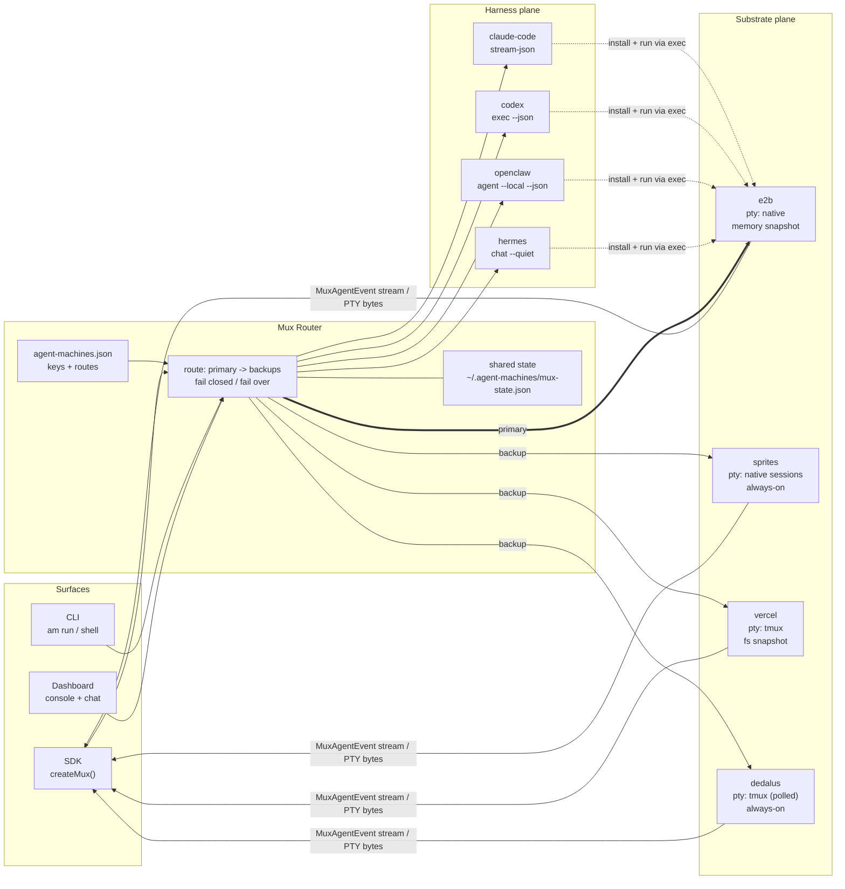

# The Agent Machines Multiplexer

> `src/mux/` -- one router across two planes: **harnesses** (which agent)
> and **substrates** (which sandbox). Pick both per run, fail over inside
> a plane, stream everything.

This is the "health-aware fallback / automatic failover" milestone from
the YC application, delivered as a library that works in three surfaces
with the same core: programmatically (`agent-machines` npm package), in
a terminal (CLI), and inside the dashboard.

## The idea

Terminal multiplexers (tmux, and agent-aware successors like herdr)
proved a model: a persistent session server holds the PTYs; thin clients
attach, detach, and switch. Agent Machines lifts that model to the
cloud and splits it into two orthogonal planes:

- **Substrate plane (sandbox mux).** E2B, Sprites, Vercel Sandbox, and
  Dedalus behind one `SandboxProvider` contract: create, connect, exec,
  streamed exec, PTY, files, public URLs, sleep/wake, destroy. Each
  provider declares capabilities (`pty: native | tmux | none`,
  persistence model, reattach) instead of pretending to be identical.
- **Harness plane (agent mux).** Claude Code, Codex, OpenClaw, and
  Hermes behind one `HarnessAdapter` contract: idempotent install,
  auth injection from `UpstreamKeys`, a streamed headless run command,
  an interactive command for PTYs, and a `parseLine` normalizer that
  turns each CLI's wire format into one `MuxAgentEvent` union.

The router composes the planes: a route is `harness x substrate`,
substrates are ordered primary -> backups, credential gaps are skipped
up front (fail closed), and provisioning errors that another substrate
could avoid (transient, rate-limited) fail over automatically. Runs are
never silently replayed across substrates -- failover happens at
machine creation, not mid-run, so there is no idempotency hazard.

## Diagram



Data flows: every harness is installed and driven *through the
substrate's exec/PTY primitives*, so a fifth substrate gets all four
agents for free, and a fifth agent gets all four substrates for free.

## One JSON and it works

```json
{
  "keys": {
    "anthropic": "env:ANTHROPIC_API_KEY",
    "openai": "env:OPENAI_API_KEY"
  },
  "providers": {
    "e2b": "env:E2B_API_KEY",
    "sprites": "env:SPRITES_TOKEN"
  },
  "sandboxes": { "primary": "e2b", "backups": ["sprites", "vercel"] },
  "agents": { "default": "claude-code" }
}
```

Raw keys are accepted in place of `env:` indirection. Anything missing
falls back to conventional environment variables. A provider without
credentials is skipped, never errored into.

## Programmatic use

```ts
import { createMux } from "agent-machines";

const mux = createMux(); // discovers agent-machines.json

const machine = await mux.create({
  agent: "claude-code",
  sandbox: "auto", // primary -> backups
  name: "reviewer",
});

for await (const event of machine.run("review this repo")) {
  if (event.type === "text") process.stdout.write(event.delta);
}

// interactive: a real PTY (native on e2b/sprites, tmux elsewhere)
const pty = await machine.pty();
pty.write("ls -la\n");
for await (const bytes of pty.output) render(bytes);

// later, from any process on this machine:
const same = await mux.connect("reviewer");
```

## Capability matrix

| Substrate | PTY | Streamed exec | Persistence | Reattach | Measured (2026-07-31) |
| --- | --- | --- | --- | --- | --- |
| e2b | native (`sandbox.pty`) | yes | memory snapshot (pause/connect) | yes | create 265ms, exec 122ms |
| sprites | native (detachable sessions) | yes | always-on VM + checkpoints | yes | exec 296ms cold / 87ms warm |
| vercel | tmux-over-exec | yes (`Command.logs()`) | filesystem snapshot | yes (by name) | exec p50 290ms (5/2026) |
| dedalus | tmux-over-exec, polled | no (REST) | always-on | yes | exec p50 866ms (5/2026) |

| Harness | Streamed events | Auth | Notes |
| --- | --- | --- | --- |
| claude-code | stream-json NDJSON | `ANTHROPIC_API_KEY` | `IS_SANDBOX=1` required as root |
| codex | `--json` JSONL | `CODEX_API_KEY` (env only) | Landlock off in containers |
| openclaw | final JSON envelope | anthropic or openai | strict Node engine ranges |
| hermes | plain text | anthropic or openai | curl installer, Python venv |

## Failover semantics

1. `routeFor()` orders `[explicit] or [primary, ...backups]` and drops
   uncredentialed providers with a recorded `skipped` attempt.
2. `create()` walks candidates; `MuxError` kinds `transient` and
   `rate_limited` (and unknown errors) advance to the next candidate;
   `missing_credentials` / `not_supported` do not retry (they would fail
   everywhere the same way or were already skipped).
3. Every decision lands in `machine.attempts` -- the route is
   explainable after the fact, which is the contract the dashboard
   needs to render "why did this land on sprites?".

## Terminal front-end options

The mux hands back raw PTY bytes, so the renderer is a separate choice.
Today the dashboard uses `@xterm/xterm` 6. Two 2026 alternatives are
worth tracking, both driven by Ghostty's VT engine compiled to WASM:

- `ghostty-web` (MIT, 0.4.0) -- Ghostty's VT100 parser via WebAssembly
  with an xterm.js-compatible API, so it is a drop-in swap. ~2.2 MB
  unpacked, versus xterm.js's much smaller footprint; the trade is
  fidelity and DOM-first selection/find/screen-reader behavior against
  bundle size.
- Vercel's Native SDK `<terminal />` (the July 2026 announcement) is a
  *native desktop* component built on libghostty-vt -- macOS, Windows,
  Linux, no browser. It is not usable from this web app, but it is the
  right primitive if Agent Machines ever ships a desktop console, and its
  session record/replay model is a good reference for what to log.

Neither changes the data plane: whichever renderer is used, it consumes
the same `PtyHandle` byte stream.

## What this deliberately is not

- Not a daemon. Substrate vendors already persist sandboxes; the mux
  remembers placements in a small state file and reconnects.
- Not mid-run replay. Failover is at placement time only.
- Not a fifth sandbox. Route, don't rebuild.
