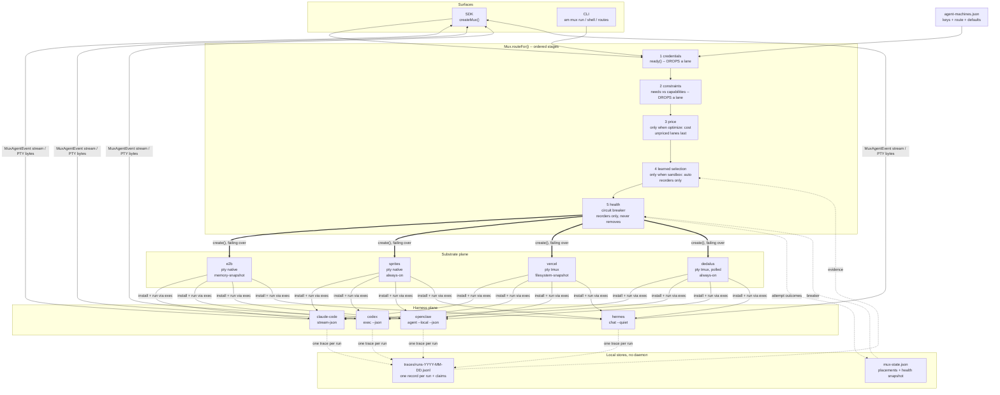

# The Agent Machines Multiplexer

> `src/mux/` -- one router across two planes: **harnesses** (which agent)
> and **substrates** (which sandbox). Pick both per run, explain every
> placement, stream everything.

Read this first if you are new to the repo. It describes the direct-to-substrate
library in `src/mux/` -- what it decides, what it measures, and what it
deliberately does not do. Numbers here are derived from the code and from
[MUX-RESULTS.md](./MUX-RESULTS.md), and `src/lib/mux-docs.test.ts` fails the
build if this file and the source disagree.

**Two surfaces, and only one of them is this.** The hosted control plane
(`web/`) adapts the same four vendors through its own `MachineProvider`
contract and has only part of the routing below: create-time failover
(2026-08-02, `web/lib/mux/failover.ts`) whose order is credential-gated and,
since 2026-08-04, reordered by this same circuit breaker held per tenant
(`web/lib/mux/health.ts`) -- but still no constraints and an advisory
recommendation rather than a learned order, and health there informs the
provisioning route only. See
[which surface has what](#which-surface-has-what) and item 0 of
[ROADMAP.md](./ROADMAP.md).

- [The two planes](#the-two-planes)
- [How a route is decided](#how-a-route-is-decided)
- [Diagram](#diagram)
- [One JSON and it works](#one-json-and-it-works)
- [Programmatic use](#programmatic-use)
- [Capabilities](#capabilities)
- [Price](#price)
- [Health](#health)
- [Learned selection](#learned-selection)
- [Traces, and idempotency](#traces-and-idempotency)
- [Failover semantics](#failover-semantics)
- [Lifecycle without waking the machine](#lifecycle-without-waking-the-machine)
- [Agent switch and substrate migration](#agent-switch-and-substrate-migration)
- [Model upstreams](#model-upstreams)
- [Detached work](#detached-work)
- [Reporting surface](#reporting-surface)
- [Measured](#measured)
- [Which surface has what](#which-surface-has-what)
- [Terminal front-end options](#terminal-front-end-options)
- [What this deliberately is not](#what-this-deliberately-is-not)

## The two planes

Terminal multiplexers (tmux, and agent-aware successors like herdr) proved a
model: a persistent session server holds the PTYs; thin clients attach, detach,
and switch. Agent Machines lifts that to the cloud and splits it into two
orthogonal planes.

- **Substrate plane (sandbox mux).** 4 substrate adapters -- E2B, Sprites,
  Vercel Sandbox and Dedalus -- behind one `SandboxProvider` contract
  (`src/mux/types.ts`): create, connect, exec, streamed exec, PTY, files,
  public URLs, sleep/wake, no-wake describe/remove/park, destroy. Each declares
  its capabilities instead of pretending to be identical, and every declared
  vendor fact carries the URL and the date it was read.
- **Harness plane (agent mux).** 4 agent harnesses -- Claude Code, Codex,
  OpenClaw and Hermes -- behind one `HarnessAdapter` contract: idempotent
  install, auth injection from `UpstreamKeys`, a streamed headless run command,
  an interactive command for PTYs, and a `parseLine` normalizer that turns each
  CLI's wire format into one `MuxAgentEvent` union.

A route is `harness x substrate`. Every harness is installed and driven
*through the substrate's exec/PTY primitives*, so a fifth substrate gets all
four agents for free and a fifth agent gets all four substrates for free.

## How a route is decided

`Mux.routeFor()` (`src/mux/router.ts`) runs five stages in this order. Only the
first two ever remove a lane; the last three return permutations, because a
policy or an incident that dislikes every lane must not make `create()`
impossible.

| # | Stage | Source | Removes a lane? | When it runs |
|---|---|---|---|---|
| 1 | Credentials | `SandboxProvider.ready()` | yes -- fail closed, naming the missing variables | always |
| 2 | Constraints | `src/mux/constraints.ts` | yes -- naming the failed dimension (`constraint: "pty"`) | when the caller declares `needs` |
| 3 | Price | `src/mux/cost.ts` | no -- cheapest modeled total first, unpriced lanes LAST | only with `optimize: "cost"` |
| 4 | Learned selection | `src/mux/selection.ts` | no -- best expected value first | only for `sandbox: "auto"` with no `optimize`, and more than one survivor |
| 5 | Health | `src/mux/health.ts` | no -- healthy, then degraded, then open | always |

Health is deliberately LAST. It answers "is this lane up right now", which is a
more urgent question than "which lane pays off": a lane whose breaker is open
goes to the back however good its history looks. Stage 4 is skipped for a
pinned substrate on purpose -- a pin is the caller's escape hatch and comes back
exactly as asked, unscored, so the policy never appears to have made a choice it
did not make.

Every stage's outcome lands on `machine.attempts`, and `am mux routes` prints
the same five stages for a route before you run it.

## Diagram



## One JSON and it works

```json
{
  "keys": {
    "anthropic": "env:ANTHROPIC_API_KEY",
    "openai": "env:OPENAI_API_KEY"
  },
  "providers": {
    "e2b": "env:E2B_API_KEY",
    "sprites": "env:SPRITES_TOKEN"
  },
  "sandboxes": { "primary": "e2b", "backups": ["sprites", "dedalus"] },
  "agents": { "default": "claude-code" }
}
```

Raw keys are accepted in place of `env:` indirection. Anything missing falls
back to conventional environment variables. A provider without credentials is
skipped with the missing variables named, never errored into.

## Programmatic use

```ts
import { createMux } from "agent-machines";

const mux = createMux(); // discovers agent-machines.json

const machine = await mux.create({
  agent: "claude-code",
  sandbox: "auto",                                    // route, don't pin
  constraints: { pty: "native", maxRuntimeMs: 3_600_000 },
  optimize: "cost",     // opt-in. Setting it hands the ORDER to price, so the
                        // learned policy stands down: an explicit objective is
                        // not something a score gets to override. Omit it to
                        // let stage 4 order the lanes.
  name: "reviewer",
});

for await (const event of machine.run("review this repo", { runKey: "review-42" })) {
  if (event.type === "text") process.stdout.write(event.delta);
}

console.log(machine.attempts);   // every lane considered, with the reason
console.log(machine.selection);  // the score and terms behind the order, when it ran

// interactive: a real PTY (native on e2b/sprites, tmux elsewhere)
const pty = await machine.pty();
pty.write("ls -la\n");
for await (const bytes of pty.output) render(bytes);

// later, from any process on this host -- or any host, under a hosted store:
const same = await mux.connect("reviewer");
```

### Where placements live

By default a local JSON file (`~/.agent-machines/mux-state.json`, overridable
with `AGENT_MACHINES_MUX_STATE`), written under a lock with an atomic rename so
two processes on one host cannot lose each other's writes.

`PlacementStore` is the seam, and it is await-tolerant: `read`, `remember`,
`forget`, `saveHealth`, plus a `synchronous` flag the router reads to decide how
much it may do inline. `setPlacementStore()` installs another one --
`web/lib/mux/placement-store.ts` is a Supabase implementation, for callers with
no durable home directory (a serverless function's `$HOME` does not survive the
next invocation, so the local store silently forgets every machine it created
there).

Two consequences of an async store, both deliberate:

- `Mux`'s constructor cannot await, so persisted health is loaded eagerly only
  when the store says it is synchronous. Under an async store the breaker starts
  empty and is filled before the first operation health can influence. Health
  never removes a lane, so "no history yet" degrades to the configured order --
  which is why this is safe to defer and a placement read is not.
- `readMuxState()` and the other synchronous functions THROW under an async
  store, naming the async API, rather than returning a promise from a function
  typed to return state. That mistake would read as "no machines remembered" and
  provision a duplicate. The CLI keeps using them: it is the local-first path by
  definition.

`PtyHandle.output` is single-consumer by contract: it is a live byte stream with
no buffer to replay from, so a second iteration throws instead of silently
splitting chunks between two readers. Fan out from it if several viewers need
the same pane.

## Capabilities

Six behavioral axes are required of every adapter, because each one
demonstrably implements a value:

| Substrate | PTY | Streamed exec | Persistence | Detached work | Reattach | Public URL |
| --- | --- | --- | --- | --- | --- | --- |
| `e2b` | native (`sandbox.pty`) | yes | memory-snapshot | reliable | yes | yes |
| `sprites` | native (detachable sessions) | yes | always-on | throttled | yes | yes |
| `vercel` | tmux over exec | yes (`Command.logs()`) | filesystem-snapshot | reliable | yes | yes |
| `dedalus` | tmux over exec, polled | no (batch REST) | always-on | reliable | yes | yes |

Six further axes are vendor facts and are **optional**: `region`, `gpu`,
`network` (egress posture), `fork`, `publicPorts`, and `limits` (base and
maximum vCPU / memory / disk, max runtime, concurrency, and whether a
`resources` request is honored). An absent axis reads as `"unknown"`, and an
unknown REJECTS any constraint that needs it -- an unprovable floor loses the
lane rather than being hoped for. Being able to *ask* for something only counts
when the request is `"honored"`: a forwarded-but-ignored request looks like
success at placement time and starves the run later. E2B's sizing request is
declared `"unknown"` for exactly that reason (MUX-RESULTS.md finding 10).

### Asking for a size, and asking what a name means

`CreateSandboxOptions.resources` takes `vcpu`, `memoryMib` and `diskGib` -- the
same three axes `SandboxDescription.resources` reports back, so a request and the
vendor's answer to it are directly comparable. Substrates that do not expose
sizing ignore the request rather than failing; only Dedalus takes all three
today, clamped to its documented plan ceilings (an over-plan request is still
satisfiable, just smaller, and `limits` already states the ceiling).

`CreateSandboxOptions.onNameConflict` decides what `name` MEANS on substrates
where the caller names the sandbox (sprites; the others get vendor ids and ignore
it):

| | `"adopt"` (default) | `"unique"` |
| --- | --- | --- |
| the name is | an identity | a label |
| derived name | deterministic | suffixed |
| existing sandbox with that name | adopted | never |
| two callers, one name | one sandbox | two sandboxes |

Both are correct for someone. A named `create()` has to be idempotent for
`connect(name)` to work from another process, which is `"adopt"`. A dashboard
lets two machines share a display name, and adopting there made them the same
sprite -- a live failure in MUX-RESULTS. The axis is what lets one adapter serve
both.

`RouteConstraints` (`src/mux/constraints.ts`) is the caller's side of the same
model: `pty`, `persistence`, `reattach`, `publicUrl`, `streamingExec`, `region`,
`gpu`, `egress`, `fork`, `minVcpu`, `minMemoryMib`, `minDiskGib`,
`minPublicPorts`, `minConcurrency`, `maxRuntimeMs`. A rejection carries the
dimension and both values, so "why did this land on sprites?" has a structural
answer and not just prose.

## Price

Every rate in `SUBSTRATE_PRICES` (`src/mux/cost.ts`) is a published list price
with the source URL and read date beside it. A rate that is not published is
`known: false` -- never a guess, and never a zero.

| Substrate | Published rate | Modeled 10-min run |
| --- | --- | --- |
| `e2b` | yes | $0.0222 |
| `sprites` | no -- Fly publishes no Sprites compute rate | unknown |
| `vercel` | yes | $0.0503 (an upper bound: active-CPU billing excludes model wait) |
| `dedalus` | yes | $0.0200 |

The unit being optimized is **one completed agent run**, not one sandbox
minute, so `costToSuccessfulResult` charges failed failover legs to the success
they eventually produced: a lane that is cheaper per hour and fails one attempt
in three costs more per result than the lane it undercuts. Install time is part
of the run. Model tokens usually dominate compute -- ten minutes of a 2 vCPU
sandbox is about a cent on every priced lane, while one measured Claude Code
turn cost $0.0107 -- so model spend is passed in separately and never folded
into the compute model.

Unpriced lanes sort LAST under `optimize: "cost"`. Nothing here bills anybody:
this is a model of a bill used to order a route.

## Health

`src/mux/health.ts` is a rolling-window circuit breaker per substrate,
persisted in the shared state file so a failing lane stays de-prioritized
across processes. Defaults: the last 20 attempts inside a window of 5 minutes, a
breaker that opens after 3 consecutive transport failures, and a 30s cooldown
before an open lane is probeable again.

Three deliberate properties:

- **Advisory, never exclusive.** `order()` reorders and never removes. A
  provider-wide incident, or a laptop that lost DNS for ten seconds, would
  otherwise open every lane at once. A last-resort attempt on an open lane
  beats no attempt.
- **Transport failures only.** `missing_credentials` and `not_supported` are
  never recorded at all, and `fatal` is counted for diagnostics but never trips
  the breaker: a config mistake or a harness install that fails identically
  everywhere says nothing about whether the substrate is reachable.
  `rate_limited` does count -- a throttled lane genuinely cannot serve, which
  is what a cooldown expresses.
- **No half-open state.** A breaker whose cooldown has elapsed reports
  `degraded`, which behaves exactly as half-open wants: the lane is eligible
  again so one real attempt probes it, while healthy lanes are still preferred.

The thresholds are measured, not tasteful. Sprites `create` returns
intermittent 500s that still create the sprite, and 2 of 3 identical requests
failed in one measured run, so a threshold of 2 would trip on a substrate that
was working.

### On the hosted plane (2026-08-04)

The breaker above is the only one: `web/lib/mux/health.ts` value-imports it
through the compiled package rather than reimplementing it, so there is one
tuning, one snapshot version and one "fatal never opens a circuit" rule to
reason about. What the hosted side adds is scope and I/O -- the snapshot is read
and written **per tenant**, as the `kind = 'health'` row of `mux_placements`
(migration 006), because one user's expired key says nothing about another
user's lane.

Precisely what consults it: the provisioning route's failover walk
(`web/app/api/dashboard/admin/provision-machine/route.ts`), which reorders its
credentialed lanes and feeds every lane's outcome back. Nothing else does. A
substrate migration pins one lane by construction, so there is no order for
health to change there, and wake/sleep/run do not route at all. A requested lane
that health demotes is still walked -- last -- and the response says the machine
was placed *ahead of* it rather than *after it failed*, because it was never
tried.

## Learned selection

`src/mux/selection.ts` scores `harness x substrate` lanes from **our own run
traces** and orders an `auto` route by expected value. It is on by default; with
an empty trace store every lane scores the prior identically, so a fresh
install still walks the configured order.

The objective is the roadmap's priority order, as a weighted sum: task success
`0.7`, total cost to a successful result `0.2`, time to first output `0.1`. All
three are measured only on completed runs -- a run that never finished is a
failure, never a data point about how fast or how cheap a lane is.

Cold start is where a scorer usually lies, so every term is shrunk toward a
prior by its own sample count, making the score a posterior mean rather than a
raw rate. With a prior of 0.5 and 6 pseudo-runs of prior strength, the worked
example in `selection.ts` holds: one successful run scores **0.571** even when
it is also the cheapest and fastest lane on offer, while 45 successes in 50 runs
score **0.723** even when it is the most expensive and slowest. A single lucky
run therefore cannot outrank a long good record, and that margin is a property
of the prior strength rather than of the example. A lane with zero traces scores
exactly the prior, so it is never starved and stays reachable -- the only way an
unexplored lane ever earns evidence.

What it is not, stated plainly:

- **Not automatic beyond ordering.** It reorders candidates. It never adds a
  lane, never removes one, and never overrides a pinned `sandbox` or an explicit
  `optimize`.
- **Not a bandit.** No exploration bonus, no randomized arm pull. It ranks on
  evidence and leans on the prior where evidence is thin; a bad lane is revisited
  only when the lanes above it fail over.
- **Not cross-request comparable.** Two of the three terms are relative to the
  candidate set of one request, so a score means something only inside the
  ranking that produced it. The absolute measurements travel alongside it.
- **Not shared.** Evidence is the local trace store on one host. There is no
  fleet-wide policy, and the web bandit in `web/lib/learning/*` is a different
  thing on the other side of a boundary `web/` cannot import.

Below a 0.02 deadband two lanes are treated as indistinguishable and the
configured order keeps them, so a routine 0.001 reshuffle never silently
overrides an operator's preference. Scoring is deterministic: no clock, no
randomness, and exact ties keep the caller's order. The evidence window is 7
days, deliberately far longer than health's five minutes, because "is this lane
up right now" and "which lane pays off" are different time constants.

## Traces, and idempotency

`src/mux/traces.ts` is a small local store with no daemon, at
`~/.agent-machines/traces/` (override with `AGENT_MACHINES_MUX_TRACES`).

**Traces.** One append-only JSONL record per run, sharded by UTC day. Each
record carries the placement attempts verbatim, `durationMs`, `exitCode`,
`truncated`, `timeToFirstEventMs`, and cost split into `sandboxCostUsd`
(modeled from the run's wall clock) and `modelCostUsd` (what the harness itself
reported). The split is the point: the two move for different reasons, and a
conflated total cannot be attributed to either. `costUsd` is present ONLY when
both halves are known -- summing one known half with an absent one would
under-report the run by an unknown amount and rank the lane nobody can price as
the cheapest. A run counts as successful only when the harness exited 0, the
stream was not truncated, and no error was recorded.

**Claims.** `runKey` is an idempotency key, not a retry. A second `run()` with
the same key returns the stored result instead of executing the agent again --
agent runs cost money and have side effects, so a client that crashed and
retried must not double-execute one. An in-flight claim is an error rather than
a silent second execution, and a claim whose holder stops heartbeating frees
itself after 30 minutes so a crash cannot block a key forever.

## Failover semantics

1. `routeFor()` produces the ordered candidate list described
   [above](#how-a-route-is-decided) plus a `skipped` attempt for every lane it
   dropped.
2. `create()` walks the candidates. `MuxError` kinds `transient`,
   `rate_limited` and `fatal` (and any unrecognized error) advance to the next
   lane; `missing_credentials` and `not_supported` do not retry, because they
   would fail identically everywhere or were already screened out.
3. A sandbox that was provisioned before a later failure (install, remember) is
   torn down rather than left billing while the router moves on. A teardown that
   itself fails is recorded, so a leak is never silent.
4. Every decision -- skipped, failed, chosen, with reason, duration, health
   state, modeled price, and the learned score when the policy ran -- lands in
   `machine.attempts` and in the run's trace record. A route that cannot be
   explained is a bug.

Failover is **placement-time only**. A run that dies mid-stream comes back with
`truncated: true` and is never replayed: replaying an agent turn without a
dedupe key can write to a repo twice, which is worse than a failed run. So
truncation is the resume-reliability *proxy* on the reporting surface -- how
often a route leaves a run that would have needed a resume -- and not a
measurement of resumes that worked.

## Lifecycle without waking the machine

`connect()` RESUMES a parked sandbox on e2b and vercel, so polling status
through a handle bills a parked machine for being looked at. Three optional
provider members exist for that reason, each verified against the vendor SDK:

- `describe(id)` -- normalized state plus the vendor's own status word
  verbatim, because the normalized state is deliberately coarse (Sprites
  reports both "warm" and "cold" as `sleeping`, and only the raw word says
  whether the next exec answers in ~60ms or has to boot).
- `remove(id)` -- destroy without resuming. Idempotent: an id the vendor no
  longer knows resolves rather than throwing.
- `park(id)` -- pause without a resume round trip.

They are optional following the `keepAlive` pattern: a caller must degrade when
a substrate omits one, never assume it. Sprites and Dedalus deliberately omit
`park()` -- the Sprites SDK has no suspend, and Dedalus's sleep is an HMAC-gated
internal route a public key gets 401 on -- because a `park()` that resolved
without parking would be a false claim.

`Mux.remove(name)` forgets a placement only when the substrate confirms the
sandbox is gone, and rethrows otherwise: an ambiguous teardown failure must not
make a possibly-alive machine invisible by name.

## Agent switch and substrate migration

The product's two persisting verbs, one per plane. `switchAgent(name, agent)`
changes which harness ANSWERS on a machine -- the sandbox and its load stay
put. `migrate(name, { to })` changes which substrate CARRIES the load -- the
agent and the name stay put. They never compose in one call: "hermes on
sprites, starting from openclaw on e2b" is one verb then the other, so each
step has exactly one point of no return. The two verbs also exclude each other
per machine (a shared claim), because a switch that re-asserted a stale
snapshot over a mid-flight migration would point the placement at a destroyed
sandbox.

`switchAgent` connects (waking a parked sandbox: a switch is a write),
installs the target harness if missing -- same budgets and the same
foreground-install rule on throttled lanes as `create()` -- then proves the
harness ANSWERS with its version probe before the placement flips. An install
that exits 0 but does not answer never persists. The old harness is never
uninstalled, so rollback is `switchAgent` back: seconds, no install.

`migrate` orders its steps so that every failure before the commit leaves the
ORIGINAL placement intact and addressable: gate (an uncredentialed target
names its missing keys before the source is even woken), provision on the
pinned lane, install, export, restore, verify, and only then the placement
write, after which the source is destroyed (or parked/kept via `source:`).
State is copied, never moved destructively; checksums are verified on both
ends, and a marker written on the source must read back byte-identical on the
target before anything commits.

What moves is an explicit allowlist, not the disk: the `~/.agent-machines`
persona and state tree (SOUL/AGENTS/MEMORY/USER docs, skills, loadout, state,
chats, artifacts, crons, mcps, sessions) plus each harness's own resumable
state (`~/.claude` + `~/.claude.json`, `~/.codex`, `~/.openclaw`, hermes's
config and state db). Toolchains are re-derived by the idempotent installers
rather than copied (an x64 binary shipped to an arm64 box is a broken machine),
and credentials are re-injected from config, never round-tripped. Losses are
DECLARED in the report, not implied: running processes and tmux scrollback,
`/tmp`, ad-hoc system packages, create-time env vars, and e2b RAM state (its
persistence is a memory snapshot no file copy captures). `moveState: false`
ships nothing and says so -- the report's `lost` list then names the whole
file contract.

The report is the API response: moved, re-derived, lost, skipped, bytes, both
sandbox ids, the verify evidence, and what happened to the source -- including
a named orphan if the post-commit destroy failed. CLI: `am mux switch --name X
--agent hermes`, `am mux migrate --name X --to sprites`.

## Model upstreams

`src/mux/upstreams.ts` decides which key drives which harness, per harness and
per wire format, and the rules were verified against the live APIs
([UPSTREAMS.md](./UPSTREAMS.md)) rather than read from documentation:

- A gateway key is not second-class. OpenRouter serves an Anthropic-Messages
  endpoint as well as an OpenAI one, so a single OpenRouter key drives both
  `claude-code` (via `ANTHROPIC_BASE_URL`) and `codex` (via `OPENAI_BASE_URL`).
  The router's original native-key-only rule was simply wrong.
- The gate runs BEFORE provisioning. `create()` calls `requireUpstream(agent)`
  first, so a harness with no usable key fails closed with the missing key named
  instead of provisioning a machine that cannot answer. What the gate checks is
  the KEY, not the model id.
- Model ids are namespaced per upstream, and that part is still the caller's
  job. A gateway wants `anthropic/claude-sonnet-4.5`; a native Anthropic key
  wants `claude-sonnet-4-5`. The mux passes `model` through to the harness
  verbatim, so a native id sent to a gateway is a silent 404 at request time,
  long after routing "succeeded". Read UPSTREAMS.md before choosing an id; the
  mux does not rewrite it, and it does not pretend to.

## Detached work

Long installs are not held on one connection: a foreground install outlived
E2B's sandbox budget and tripped Sprites' WebSocket keepalive, so installs
write a script into the sandbox, launch it detached, and poll for an exit-code
sentinel. That makes duration independent of any connection limit and makes
re-running idempotent.

But detaching is not free everywhere, which is why `detachedWork` is a declared
capability. Measured on Sprites 2026-08-01: the identical OpenClaw install
finishes in 16.9s in the foreground and does NOT finish in 15 minutes detached
-- inside a detached session a `curl` that takes 0.11s interactively stalls
indefinitely. `ensureInstalled` therefore runs the install on the open
connection for `throttled` lanes. The same fix made Hermes on Sprites about 100
times faster, so the throttling had been silently taxing the cells that passed.

## Reporting surface

Three read-only CLI commands, all of which work with zero traces, zero
credentials and an empty state file, and exit 0 while saying why a table is
empty:

```bash
am mux stats  [--since 24h] [--limit <n>] [--json]   # measured outcomes by route
am mux health [--json]                               # circuit state per substrate
am mux routes [--sandbox <s>] [--agent <a>]          # the resolved route, and why
              [--needs <json>] [--optimize cost] [--json]
```

`stats` reports the four owed numbers per `harness@substrate` lane: task
success, time to first output (p50 and p95), total cost to a successful result,
and the truncation rate as the resume proxy. `routes` prints the five stages,
what each one dropped or reordered, and -- when the policy ran -- the score and
sample count per lane with the term that decided the order.

Two rendering rules hold across all three, and exist because zero is the best
possible value for a cost: **a number nobody measured renders as "unknown",
never 0 and never a bare dash**, and **a stage that did not run says so** ("not
applied", "no samples") rather than borrowing the word unknown.

## Measured

Full detail, including every finding that changed the implementation, is in
[MUX-RESULTS.md](./MUX-RESULTS.md). Headline, measured against real provider
APIs with real model keys:

**16 of 16 cells pass** live: every one of the 4 harnesses on every one of the
4 substrates -- e2b, sprites, dedalus and vercel -- each exiting 0 with text
flowing back through the normalized event stream. Since 2026-08-03 the live
script asserts BOTH the exit code and the `MUX-OK` sentinel in the text; the
recorded 16/16 numbers predate that and were gated on the exit code alone --
MUX-RESULTS.md says what each vintage does and does not prove. The last four
cells opened on 2026-08-02 with a `VERCEL_OIDC_TOKEN` and no code change,
which is what "blocked on a credential" meant.

| Substrate | create | first event (claude-code) | Notes |
| --- | --- | --- | --- |
| e2b | 134-425ms | 993ms | installs 5.1-25.7s depending on harness |
| sprites | 401ms warm, 17-31s cold | 2097ms | exec 296ms cold / 87ms warm (`execFileHTTP` fast path) |
| vercel | 380-961ms | 826ms | fastest to first output measured (826ms against E2B's 993ms), and the lane with no native PTY |
| dedalus | ~3s | 4947ms | slowest create: batch REST, so every exec is submit-then-poll |

Provisioning speed and interactive fidelity are independent axes, which the
vercel row is the cleanest evidence for: fastest to first event, and terminals
there still run through tmux-over-exec.

Also verified live: PTY open 108-201ms with keystroke echo 49-103ms on e2b and
sprites; named PTY reattach replaying the pane with the background process still
running on both; and the CLI streaming a real answer
(`claude-code on e2b: 3615ms, $0.0107`).

Two cells that used to be red are worth knowing about, because both failures
were ours: Hermes' vendor curl installer exhausted E2B's 478 MB base sandbox
until it was replaced with the published wheel under `uv` (5.1s), and OpenClaw
on Sprites never finished until detached work was understood (see
[Detached work](#detached-work)).

## Which surface has what

| Capability | src/mux (this doc) | hosted control plane (`web/`) |
| --- | --- | --- |
| Provider contract | `SandboxProvider` | `MachineProvider`, since 2026-08-03 a facade over the same four mux providers -- the vendor code exists once |
| Create-time failover | yes, with every attempt recorded | yes, attempts recorded, ordered by credentials then health -- no constraint filter, no price, no learned order (`web/lib/mux/failover.ts`) |
| Agent switch / substrate migrate | yes -- `switchAgent()` verifies then flips the placement; `migrate()` copies $HOME file state and commits last | yes, same ordering via its own endpoints (`machines/[id]/agent`, `machines/[id]/migrate`), progress in `migrationState` only -- no MigrateStep stream |
| Health ordering | yes, persisted circuit breaker | yes at provisioning only -- the same breaker, per tenant in `mux_placements` (`web/lib/mux/health.ts`); migrate, wake and run do not consult it |
| Constraint filtering | yes, naming the failed dimension | none |
| Learned ordering | yes, from local run traces | advisory recommendation only, from cron probes |
| Run traces | one per run | cron ingest only |
| Price as a routing input | yes, published rates with provenance | display data only |
| Metering or billing | none | none -- the product is BYOK |
| Browser console | PTY contract, single consumer | tmux-over-exec plus SSE, shipped |
| Placement store | local JSON file on one host | Clerk `UserConfig` plus Supabase |

`web/` value-imports `src/mux` at runtime through the compiled package
(`agent-machines/mux/providers/*`; the measurement history is ROADMAP.md
section 3c), and since the 0.2 deletion (2026-08-03) its four adapters are thin
bindings over these providers. Contract AND implementation are converged; the
web facade is still TYPE-checked against the real `src/mux/types.ts` source.

## Terminal front-end options

The mux hands back raw PTY bytes, so the renderer is a separate choice. Today
the dashboard uses `@xterm/xterm` 6. Two 2026 alternatives are worth tracking,
both driven by Ghostty's VT engine compiled to WASM:

- `ghostty-web` (MIT, 0.4.0) -- Ghostty's VT100 parser via WebAssembly with an
  xterm.js-compatible API, so it is a drop-in swap. ~2.2 MB unpacked versus
  xterm.js's much smaller footprint; the trade is fidelity and DOM-first
  selection/find/screen-reader behavior against bundle size.
- Vercel's Native SDK `<terminal />` (the July 2026 announcement) is a *native
  desktop* component built on libghostty-vt -- macOS, Windows, Linux, no
  browser. Not usable from this web app, but the right primitive if Agent
  Machines ever ships a desktop console, and its session record/replay model is
  a good reference for what to log.

Neither changes the data plane: whichever renderer is used, it consumes the same
`PtyHandle` byte stream.

## What this deliberately is not

- **Not a daemon.** Substrate vendors already persist sandboxes; the mux
  remembers placements in a small local file and reconnects.
- **Not mid-run replay.** Failover is at placement time only, and a broken run
  reports `truncated: true`.
- **Not billing.** No credits, no invoices, no payment path, and nothing in the
  routing path charges anybody. The price model exists to order a route, not to
  produce a bill. Bring your own provider keys.
- **Not a fifth sandbox.** Route, don't rebuild.
- **Not multi-host.** `mux.connect(name)` reads a local file, so it works from
  the host that created the machine and nowhere else.
- **Not live migration.** `migrate()` moves files, not processes: running tmux
  sessions, in-flight agent runs and RAM state do not survive the move, and the
  report says so rather than implying otherwise.
